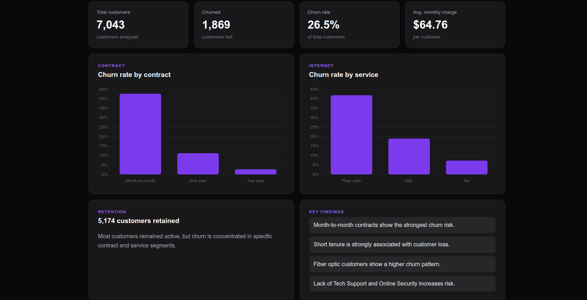
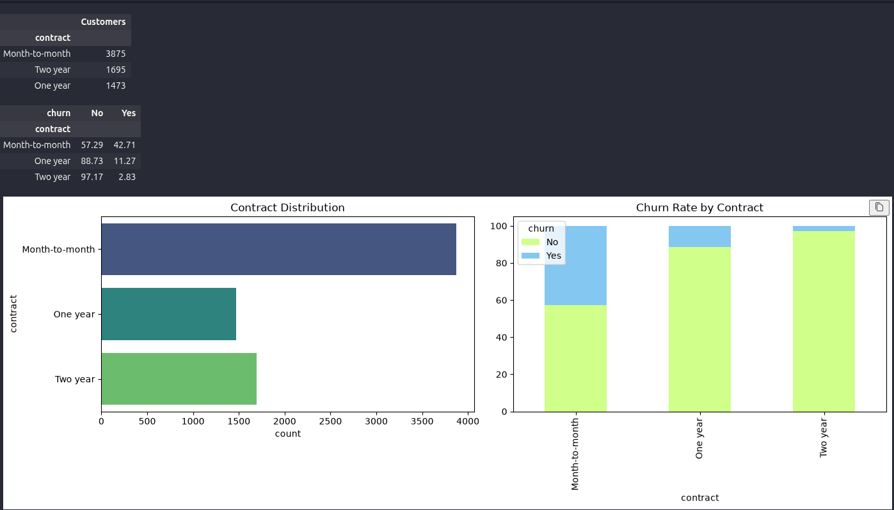
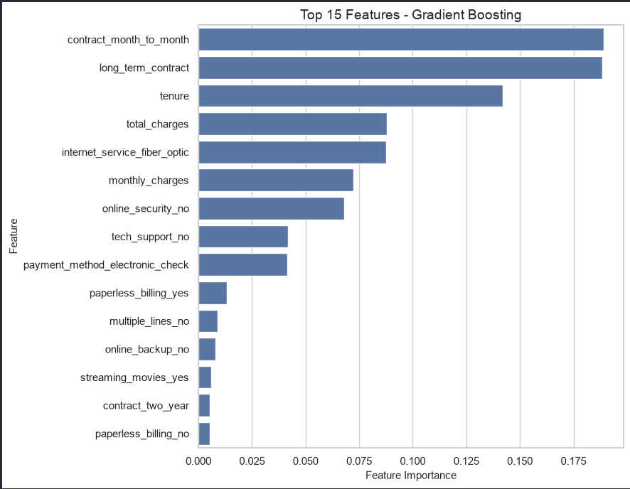
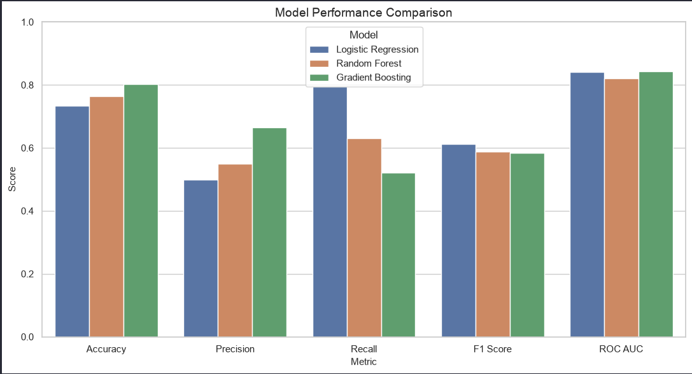
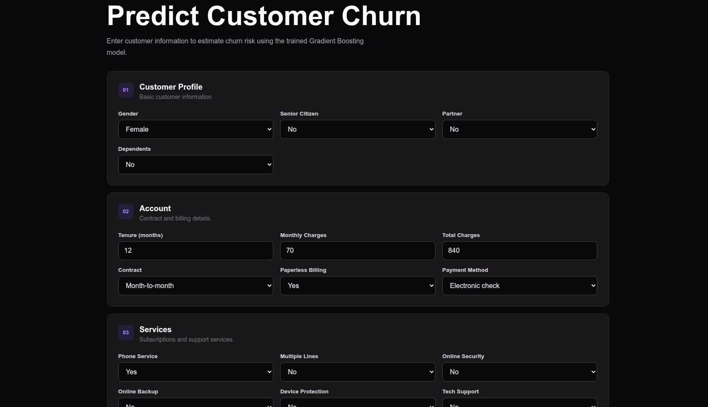
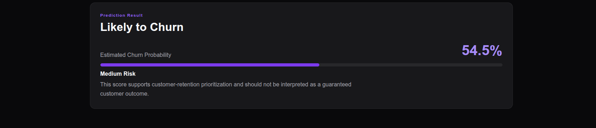

# Customer Churn Analysis

End-to-end customer churn analysis using Python, machine learning, and an interactive Flask application.

The project analyzes customer behavior, identifies the main factors associated with churn, compares multiple classification models, and translates the results into actionable customer-retention insights.



## Project Overview

Customer churn represents customers who stop using a company's services.

The objective of this project is to understand which customer characteristics are associated with churn and build a machine learning model capable of estimating churn risk.

The workflow covers:

- Data understanding and cleaning
- Exploratory data analysis
- Feature engineering
- Machine learning
- Model evaluation
- Classification threshold analysis
- Business recommendations
- Interactive churn prediction with Flask

## Dataset

The analysis uses the IBM Telco Customer Churn dataset.

The processed dataset contains **7,043 customers** and includes information about:

- Customer demographics
- Account tenure
- Contract type
- Internet services
- Support services
- Payment methods
- Monthly and total charges
- Customer churn status

### Overall Churn

| Metric | Result |
|---|---:|
| Total Customers | 7,043 |
| Churned Customers | 1,869 |
| Retained Customers | 5,174 |
| Churn Rate | 26.5% |
| Average Monthly Charges | $64.76 |

## Exploratory Data Analysis

One of the strongest patterns identified during the analysis was the relationship between **contract type and customer churn**.



Customers with month-to-month contracts showed a substantially higher churn rate:

| Contract | Churn Rate |
|---|---:|
| Month-to-month | 42.71% |
| One year | 11.27% |
| Two year | 2.83% |

This suggests that longer-term contracts are strongly associated with customer retention.

Other patterns observed during the analysis included higher churn among customers with:

- Short customer tenure
- Fiber optic internet
- Higher monthly charges
- No Tech Support
- No Online Security
- Electronic check payment method

## Machine Learning

Three classification models were trained and evaluated:

- Logistic Regression
- Random Forest
- Gradient Boosting



### Model Results

| Model | Accuracy | Precision | Recall | F1 Score | ROC-AUC |
|---|---:|---:|---:|---:|---:|
| Logistic Regression | 73.4% | 49.9% | **79.4%** | **61.3%** | 84.2% |
| Random Forest | 76.5% | 55.0% | 63.1% | 58.8% | 82.2% |
| Gradient Boosting | **80.3%** | **66.6%** | 52.1% | 58.5% | **84.2%** |

**Gradient Boosting** achieved the strongest overall predictive performance, reaching approximately **80.3% accuracy** and **84.2% ROC-AUC**.

Logistic Regression achieved the highest recall at **79.4%**, making it particularly relevant when the business cost of missing a potential churner is high.

## Key Churn Drivers

Feature importance from the Gradient Boosting model highlighted several variables with strong predictive value.



The most influential features included:

1. Contract type
2. Customer tenure
3. Total charges
4. Fiber optic internet
5. Monthly charges
6. Online Security
7. Tech Support
8. Electronic check payments

These results are consistent with the patterns observed during exploratory data analysis.

## Business Recommendations

Based on the analytical and predictive results, several retention strategies can be considered:

| Priority | Recommendation | Target |
|---|---|---|
| High | Encourage migration from month-to-month to longer-term contracts through loyalty incentives. | Month-to-month customers |
| High | Create early-retention campaigns during the first months of the customer lifecycle. | New customers |
| High | Promote Tech Support and Online Security as retention-oriented service bundles. | Customers without support services |
| Medium | Review pricing and perceived value among customers with high monthly charges. | High-charge customers |
| Medium | Use churn-risk predictions to prioritize proactive retention campaigns. | High-risk customers |

Model predictions should be used as a **customer prioritization tool**, rather than as an automatic business decision.

## Interactive Churn Predictor

A lightweight Flask application was developed to demonstrate how the trained model can be used outside the notebooks.

Users can enter customer characteristics and obtain an estimated churn probability and risk classification.

### Prediction Form



### Example Prediction



The application loads the trained Gradient Boosting model and transforms the submitted customer information into the same feature structure used during model training.

The prediction output includes:

- Predicted customer outcome
- Estimated churn probability
- Risk classification
- Visual probability indicator

The score is intended to support retention prioritization and should not be interpreted as a guaranteed customer outcome.

## Project Structure

```text
customer-churn-analysis/
│
├── app/
│   ├── app.py
│   ├── static/
│   │   └── css/
│   └── templates/
│
├── data/
│   ├── raw/
│   └── processed/
│
├── images/
│
├── models/
│   ├── best_churn_model.joblib
│   ├── gradient_boosting.joblib
│   ├── logistic.joblib
│   └── standard_scaler.joblib
│
├── notebooks/
│   ├── 01_data_understanding.ipynb
│   ├── 02_data_cleaning.ipynb
│   ├── 03_exploratory_analysis.ipynb
│   ├── 04_feature_engineering.ipynb
│   ├── 05_machine_learning.ipynb
│   ├── 06_model_evaluation.ipynb
│   └── 07_business_recommendation.ipynb
│
├── reports/
│   ├── model_results.csv
│   ├── model_evaluation.csv
│   ├── threshold_evaluation.csv
│   └── feature importance reports
│
├── .gitignore
├── README.md
└── requirements.txt
```

## Notebook Workflow

| Notebook | Purpose |
|---|---|
| `01_data_understanding.ipynb` | Dataset structure and initial inspection |
| `02_data_cleaning.ipynb` | Data quality and preprocessing |
| `03_exploratory_analysis.ipynb` | Customer behavior and churn analysis |
| `04_feature_engineering.ipynb` | Feature transformation and preparation |
| `05_machine_learning.ipynb` | Model training and comparison |
| `06_model_evaluation.ipynb` | Detailed model and threshold evaluation |
| `07_business_recommendation.ipynb` | Translation of analytical results into business actions |

## Tech Stack

**Data Analysis**

- Python
- Pandas
- NumPy
- Matplotlib

**Machine Learning**

- Scikit-learn
- Logistic Regression
- Random Forest
- Gradient Boosting
- Joblib

**Application**

- Flask
- HTML
- CSS
- Chart.js

**Development**

- Jupyter Notebook
- Git
- GitHub

## Run Locally

Clone the repository:

```bash
git clone https://github.com/Eroscardenas/customer-churn-analysis.git
cd customer-churn-analysis
```

Create a virtual environment:

```bash
python3 -m venv .venv
source .venv/bin/activate
```

Install the dependencies:

```bash
pip install -r requirements.txt
```

Run the Flask application:

```bash
python app/app.py
```

Then open:

```text
http://127.0.0.1:5000
```

## Key Takeaway

The analysis indicates that customer churn is strongly associated with **contract flexibility, customer tenure, service configuration, and pricing-related factors**.

The project demonstrates how exploratory analysis and machine learning can be combined to move from raw customer data to a practical retention-oriented decision support tool.